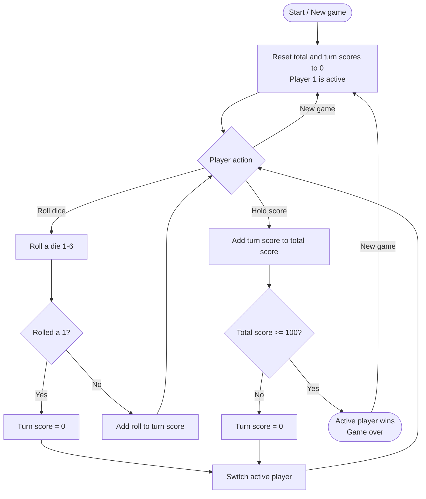

# Pig Game Flowchart

```mermaid
flowchart TD
    A([Start / New game]) --> B[Reset total and turn scores to 0<br/>Player 1 is active]
    B --> C{Player action}
    C -->|Roll dice| D[Roll a die 1-6]
    D --> E{Rolled a 1?}
    E -->|Yes| F[Turn score = 0]
    F --> G[Switch active player]
    G --> C
    E -->|No| H[Add roll to turn score]
    H --> C
    C -->|Hold score| I[Add turn score to total score]
    I --> J{Total score >= 100?}
    J -->|No| K[Turn score = 0]
    K --> G
    J -->|Yes| L([Active player wins<br/>Game over])
    L -->|New game| B
    C -->|New game| B
```
